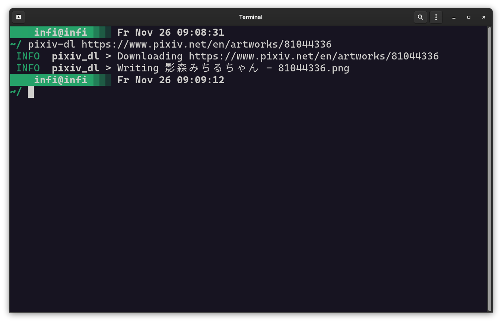

# pixiv-dl



A multithreaded [Pixiv](https://www.pixiv.net/) image downloader written in Rust.

## Usage

```bash
$ pixiv-dl https://www.pixiv.net/en/artworks/XXXXXXXX https://www.pixiv.net/en/artworks/YYYYYYYY
```

## License

This project is licensed under the [MIT license](LICENSE).